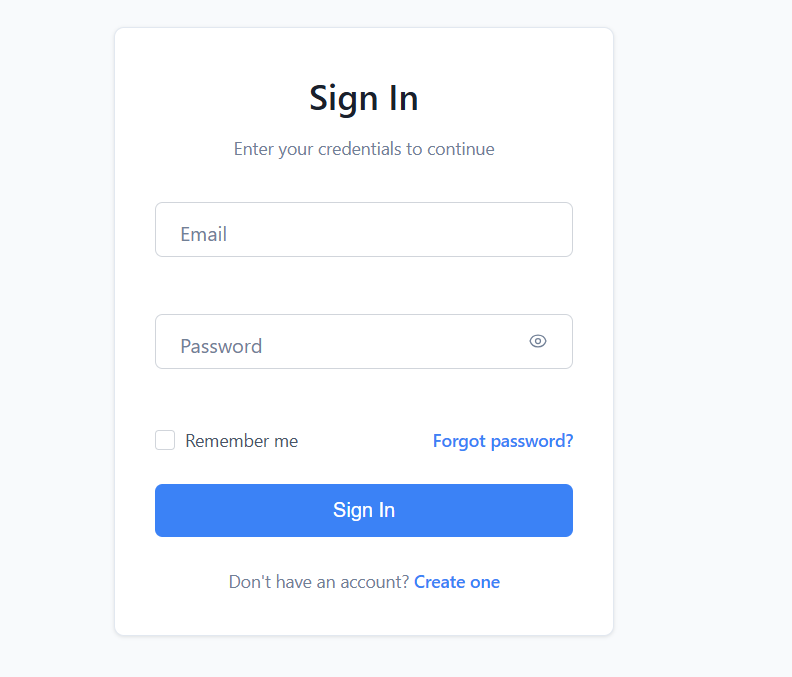
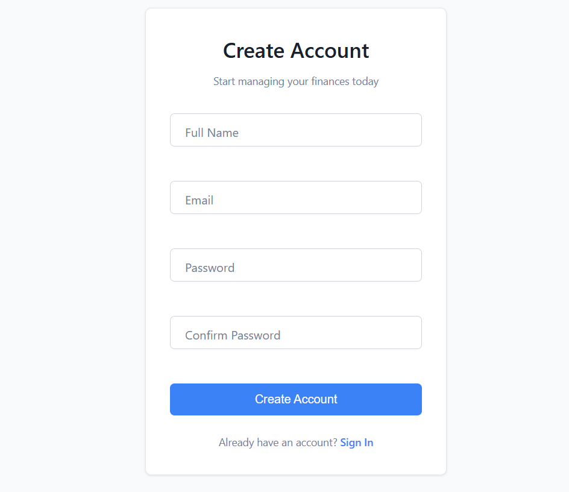
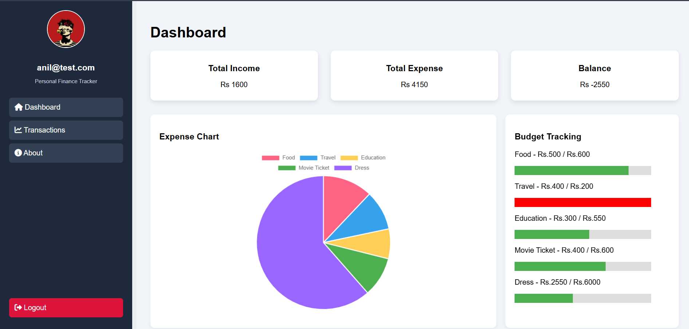
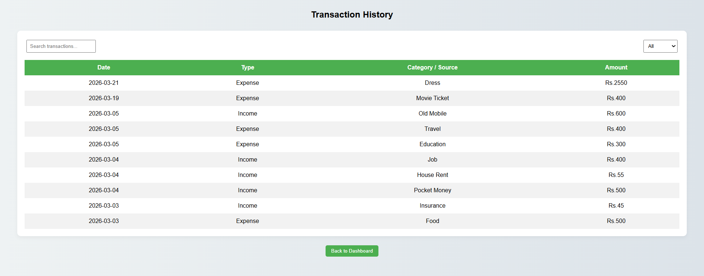
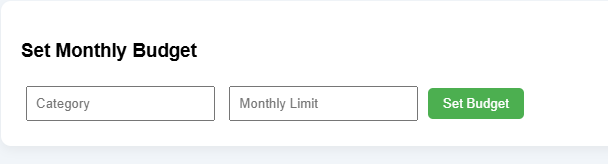

# 💼 Personal Finance Tracker

 ##  Overview

Personal Finance Tracker is a full-stack web application designed to help users efficiently manage their personal finances. The system enables structured tracking of income, expenses, and budgets while providing real-time financial summaries and visual insights.

The application follows a layered architecture using Spring Boot for backend services and PostgreSQL for persistent data storage.

## Objectives

Provide users with clear visibility of their financial activities

Enable structured income and expense management

Support category-based budget tracking

Deliver dynamic financial summaries and visual analytics

Maintain user-specific data isolation

## 🔐 User Management

Secure user registration and login

Session-based access control

User-specific financial data isolation

## 💰 Income Management

Record income with source, date, and frequency

Automatic total income calculation

Structured tabular display

## 💳 Expense Management

Record categorized expenses

Description-based tracking

Real-time total expense calculation

Table-based data representation

## 📊 Financial Dashboard

Total Income

Total Expense

Available Balance

Category-wise expense pie chart

Budget tracking indicators

## 📈 Budget Monitoring

Monthly category budget configuration

Visual progress tracking

Budget exceeded alerts

Personal-Finance-Tracker/
│
├── src/
│   ├── main/
│   │   ├── java/
│   │   │   └── com/
│   │   │       └── finance/
│   │   │           ├── controller/
│   │   │           │     ├── AuthController.java
│   │   │           │     ├── IncomeController.java
│   │   │           │     ├── ExpenseController.java
│   │   │           │     └── BudgetController.java
│   │   │           │
│   │   │           ├── service/
│   │   │           │     ├── UserService.java
│   │   │           │     ├── IncomeService.java
│   │   │           │     ├── ExpenseService.java
│   │   │           │     └── BudgetService.java
│   │   │           │
│   │   │           ├── repository/
│   │   │           │     ├── UserRepository.java
│   │   │           │     ├── IncomeRepository.java
│   │   │           │     ├── ExpenseRepository.java
│   │   │           │     └── BudgetRepository.java
│   │   │           │
│   │   │           ├── model/
│   │   │           │     ├── User.java
│   │   │           │     ├── Income.java
│   │   │           │     ├── Expense.java
│   │   │           │     └── Budget.java
│   │   │           │
│   │   │           └── FinanceTrackerApplication.java
│   │   │
│   │   ├── resources/
│   │   │   ├── static/
│   │   │   │     ├── css/
│   │   │   │     │     ├── style.css
│   │   │   │     │     └── login.css
│   │   │   │     │
│   │   │   │     ├── js/
│   │   │   │     │     ├── login.js
│   │   │   │     │     ├── dashboard.js
│   │   │   │     │     └── expense.js
│   │   │   │     │
│   │   │   │     ├── images/
│   │   │   │     │     └── user.png
│   │   │   │     │
│   │   │   │     ├── login.html
│   │   │   │     ├── register.html
│   │   │   │     ├── dashboard.html
│   │   │   │     └── transaction.html
│   │   │   │
│   │   │   └── application.properties
│   │
│   └── test/
│
├── screenshots/          
│   ├── login.png
│   ├── dashboard.png
│   ├── transactions.png
│   └── budget.png
│   
│
├── README.md
├── pom.xml
└── .gitignore

## 🏗️ System Architecture

The application follows a 3-Tier Architecture:

### 1️⃣ Presentation Layer

HTML

CSS

JavaScript

Chart.js

### 2️⃣ Business Logic Layer

Spring Boot

RESTful APIs

Service-based processing

### 3️⃣ Data Layer

PostgreSQL

JPA/Hibernate ORM

Relational mapping

## 🗄️ Database Structure
Core Entities

User

Income

Expense

Budget

Relationships

One User → Multiple Income records

One User → Multiple Expense records

One User → Multiple Budget entries

All financial records are linked through foreign key relationships.

## ⚙️ Deployment & Setup
Clone Repository
git clone <repository-url>
Configure Database

Update application.properties:
spring.datasource.url=jdbc:postgresql://localhost:5432/finance_db
spring.datasource.username=your_username
spring.datasource.password=your_password
Run Backend
mvn spring-boot:run

Access the application:

http://localhost:8082/login.html

## 📸 Screenshots

📌 Replace the image paths below with actual screenshots inside your repository (recommended folder: /screenshots).

### Login Page

### Registration Page

### Dashboard Overview

### Income & Expense Tables

### Budget Tracking

## 🔐 Security Considerations

User-specific data filtering implemented at backend

API-based data handling

Planned enhancement: JWT-based authentication

## 🚀 Future Roadmap

JWT Security Integration

Report Export (PDF/Excel)

Recurring Transactions Automation

Cloud Deployment

Mobile Responsive Enhancement

AI-based financial insights

## 👨‍💻 Author

Ch Anil Kumar

## 📄 License

This project is developed for academic and portfolio purposes.
